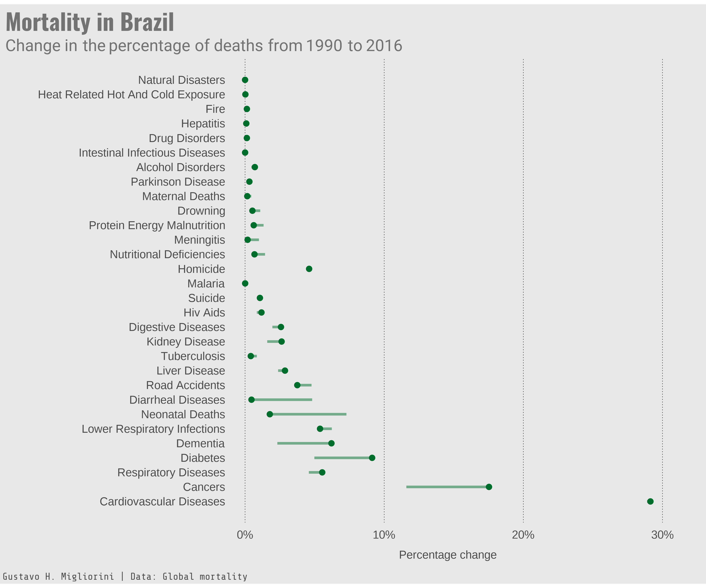

```{r echo = FALSE}
knitr::opts_chunk$set(fig.retina = 2)
```

Visualizing changes in mortality rates in Brazil according to different causes. Data from 1990 to 2016. This dataset is part of the [Tidytuesday](https://github.com/rfordatascience/tidytuesday) project and is available [here](https://github.com/rfordatascience/tidytuesday/tree/master/data/2018/2018-04-16).

```{r, warning=FALSE, message=FALSE}
# load packages
library(tidyverse)
library(showtext)
library(cowplot)
library(ggtext)
```

```{r}
# Some initial configs for the plots

# font_add_google("Oswald", "oswald") # remove the '#' to run these lines for the first time
# font_add_google("Roboto", "roboto")
# font_add_google("Share Tech Mono", "techmono")
showtext_opts(dpi = 320)
showtext_auto(enable = TRUE)

theme_set(theme_void(base_family = "Roboto"))
theme_update(axis.title.x = element_text(color = "grey30", 
                                         size = 14, 
                                         margin = margin(15,0,0,0)),
             axis.text.x = element_text(color = "grey30", 
                                        size = 14, 
                                        margin = margin(10,0,0,0)),
             axis.ticks.x = element_line(),
             axis.title.y = element_blank(),
             axis.text.y = element_text(color = "grey30", 
                                        size = 14, 
                                        hjust = 1),
             axis.ticks.y = element_line()
             )
```


```{r}
# load data
# can be loaded using the tidytuesdayR package
mortality <- readxl::read_xlsx("C:/Users/Gustavo/Downloads/global_mortality.xlsx")
#head(mortality)

# check data
summary(mortality)
```

```{r}
# clean variable names
mortality <- janitor::clean_names(mortality) |>
  rename_all(~str_remove(., '_percent'))
```


```{r}
# prepare the data
df_br <- mortality |> 
  filter(country =="Brazil") |>
  select(-conflict & -terrorism) |>
  gather(cause, percentage, cardiovascular_diseases:natural_disasters) |>
  group_by(cause) |>
  filter(year == 1990 | year == max(year)) |>
  ungroup() |>
  mutate(cause = fct_relevel(cause, unique(cause)), year = paste0("year_", year)) |>
  pivot_wider(id_cols = "cause", names_from = "year", values_from = "percentage") |>
  mutate(label_cod = as.numeric(as.factor(cause))) |>
  mutate(cause = str_replace_all(cause, "_", " ")) |>
  mutate(cause = str_to_title(cause))
  
```


```{r, warnings=FALSE}
# plot 
label_y <- df_br$label_cod
labels_cause <- df_br$cause

plot_br <- df_br |>
  ggplot() +
  geom_point(aes(x=year_2016, y=desc(label_cod)), size = 3.5, color="#006d2c") +
  geom_segment(aes(x = year_2016, xend=year_1990, 
                   y=desc(label_cod), yend=desc(label_cod)), 
               size = 3, color="#006d2c", alpha = 0.5) +
  scale_y_continuous(breaks = desc(label_y), labels = labels_cause) +
  scale_x_continuous(labels=scales::percent_format(accuracy = 1, scale = 1)) +
  labs(x = "Percentage change") +
  guides(color = "none") +
  theme(panel.grid.major.x = element_line(linetype = "14", 
                                          size = 0.3, color = "grey20"))
  
```


```{r, warning=FALSE, message=FALSE}
# graphic background
back_plt <- ggplot() +
  scale_x_continuous(limits = c(0,80), expand = c(0,0))+
  scale_y_continuous(limits = c(0,60), expand = c(0,0))+
  coord_fixed() +
  labs(title = "Mortality in Brazil", 
       subtitle = "Change in the percentage of deaths from 1990 to 2016") +
  theme_void() +
  theme(plot.background = element_rect(fill = "#E8E8E8", color = NA),
        plot.title = element_text(family = "oswald", color = "#737373", 
                                  face = "bold", size = 28, hjust = 0.01, 
                                  margin = margin(10,0,5,0)),
        plot.subtitle = element_textbox(family ="roboto", color = "#737373", 
                                        size = 20, hjust = 0.02))

# final plot
final <- ggdraw(back_plt) + 
  draw_plot(plot_br, width = 0.95, height = 0.85, y = 0.05, x = 0.02) +
  draw_text(x = 0.33, y = 0.02, 
            text = "Author: Gustavo H. Migliorini | Data: Global mortality", 
            family = "techmono", size = 12, color = "grey30", hjust = 1)

```


```{r, echo=FALSE, warning=FALSE, message=FALSE}
ragg::agg_png(here::here("plots", paste0("mortality",".png")), res = 320, width = 12, height = 10, units = "in")

final

dev.off()
```

<!-- -->


