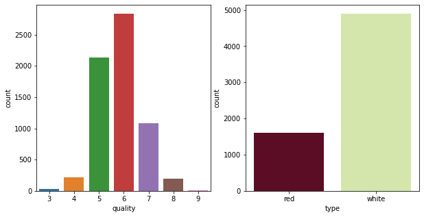
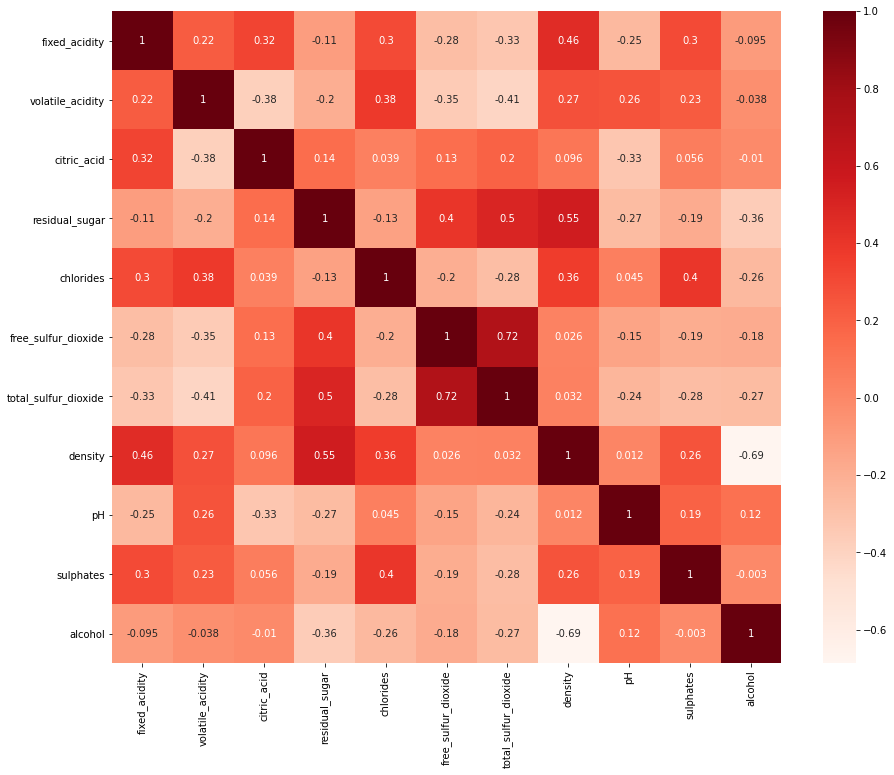
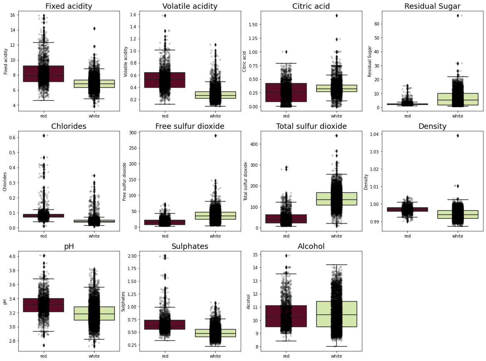
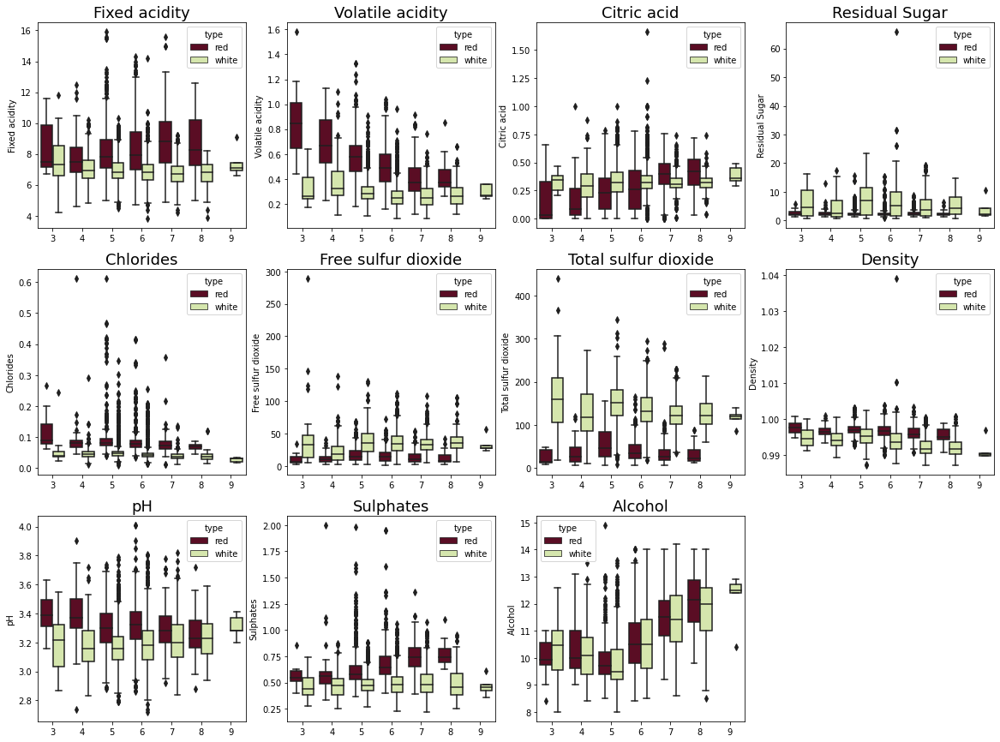

```python
# libraries
import pandas as pd
import numpy as np
import seaborn as sns
import matplotlib.pyplot as plt
```


```python
# get data and load as dataframe 
# white_wine = "https://archive.ics.uci.edu/ml/machine-learning-databases/wine-quality/winequality-white.csv"
# red_wine = "https://archive.ics.uci.edu/ml/machine-learning-databases/wine-quality/winequality-red.csv"

# df_white = pd.read_csv(white_wine, sep=";")
# df_red = pd.read_csv(red_wine, sep=";")

df_white = pd.read_csv("C:/Users/Gustavo/OneDrive/Data_Science/wine_quality/winequality-white.csv", sep=";")
df_red = pd.read_csv("C:/Users/Gustavo/OneDrive/Data_Science/wine_quality/winequality-red.csv")
```


```python
df_white.head()
```


<div>
<style scoped>
    .dataframe tbody tr th:only-of-type {
        vertical-align: middle;
    }

    .dataframe tbody tr th {
        vertical-align: top;
    }

    .dataframe thead th {
        text-align: right;
    }
</style>
<table border="1" class="dataframe">
  <thead>
    <tr style="text-align: right;">
      <th></th>
      <th>fixed acidity</th>
      <th>volatile acidity</th>
      <th>citric acid</th>
      <th>residual sugar</th>
      <th>chlorides</th>
      <th>free sulfur dioxide</th>
      <th>total sulfur dioxide</th>
      <th>density</th>
      <th>pH</th>
      <th>sulphates</th>
      <th>alcohol</th>
      <th>quality</th>
    </tr>
  </thead>
  <tbody>
    <tr>
      <th>0</th>
      <td>7.0</td>
      <td>0.27</td>
      <td>0.36</td>
      <td>20.7</td>
      <td>0.045</td>
      <td>45.0</td>
      <td>170.0</td>
      <td>1.0010</td>
      <td>3.00</td>
      <td>0.45</td>
      <td>8.8</td>
      <td>6</td>
    </tr>
    <tr>
      <th>1</th>
      <td>6.3</td>
      <td>0.30</td>
      <td>0.34</td>
      <td>1.6</td>
      <td>0.049</td>
      <td>14.0</td>
      <td>132.0</td>
      <td>0.9940</td>
      <td>3.30</td>
      <td>0.49</td>
      <td>9.5</td>
      <td>6</td>
    </tr>
    <tr>
      <th>2</th>
      <td>8.1</td>
      <td>0.28</td>
      <td>0.40</td>
      <td>6.9</td>
      <td>0.050</td>
      <td>30.0</td>
      <td>97.0</td>
      <td>0.9951</td>
      <td>3.26</td>
      <td>0.44</td>
      <td>10.1</td>
      <td>6</td>
    </tr>
    <tr>
      <th>3</th>
      <td>7.2</td>
      <td>0.23</td>
      <td>0.32</td>
      <td>8.5</td>
      <td>0.058</td>
      <td>47.0</td>
      <td>186.0</td>
      <td>0.9956</td>
      <td>3.19</td>
      <td>0.40</td>
      <td>9.9</td>
      <td>6</td>
    </tr>
    <tr>
      <th>4</th>
      <td>7.2</td>
      <td>0.23</td>
      <td>0.32</td>
      <td>8.5</td>
      <td>0.058</td>
      <td>47.0</td>
      <td>186.0</td>
      <td>0.9956</td>
      <td>3.19</td>
      <td>0.40</td>
      <td>9.9</td>
      <td>6</td>
    </tr>
  </tbody>
</table>
</div>


```python
df_red.head()
```


<div>
<style scoped>
    .dataframe tbody tr th:only-of-type {
        vertical-align: middle;
    }

    .dataframe tbody tr th {
        vertical-align: top;
    }

    .dataframe thead th {
        text-align: right;
    }
</style>
<table border="1" class="dataframe">
  <thead>
    <tr style="text-align: right;">
      <th></th>
      <th>fixed acidity</th>
      <th>volatile acidity</th>
      <th>citric acid</th>
      <th>residual sugar</th>
      <th>chlorides</th>
      <th>free sulfur dioxide</th>
      <th>total sulfur dioxide</th>
      <th>density</th>
      <th>pH</th>
      <th>sulphates</th>
      <th>alcohol</th>
      <th>quality</th>
    </tr>
  </thead>
  <tbody>
    <tr>
      <th>0</th>
      <td>7.4</td>
      <td>0.70</td>
      <td>0.00</td>
      <td>1.9</td>
      <td>0.076</td>
      <td>11.0</td>
      <td>34.0</td>
      <td>0.9978</td>
      <td>3.51</td>
      <td>0.56</td>
      <td>9.4</td>
      <td>5</td>
    </tr>
    <tr>
      <th>1</th>
      <td>7.8</td>
      <td>0.88</td>
      <td>0.00</td>
      <td>2.6</td>
      <td>0.098</td>
      <td>25.0</td>
      <td>67.0</td>
      <td>0.9968</td>
      <td>3.20</td>
      <td>0.68</td>
      <td>9.8</td>
      <td>5</td>
    </tr>
    <tr>
      <th>2</th>
      <td>7.8</td>
      <td>0.76</td>
      <td>0.04</td>
      <td>2.3</td>
      <td>0.092</td>
      <td>15.0</td>
      <td>54.0</td>
      <td>0.9970</td>
      <td>3.26</td>
      <td>0.65</td>
      <td>9.8</td>
      <td>5</td>
    </tr>
    <tr>
      <th>3</th>
      <td>11.2</td>
      <td>0.28</td>
      <td>0.56</td>
      <td>1.9</td>
      <td>0.075</td>
      <td>17.0</td>
      <td>60.0</td>
      <td>0.9980</td>
      <td>3.16</td>
      <td>0.58</td>
      <td>9.8</td>
      <td>6</td>
    </tr>
    <tr>
      <th>4</th>
      <td>7.4</td>
      <td>0.70</td>
      <td>0.00</td>
      <td>1.9</td>
      <td>0.076</td>
      <td>11.0</td>
      <td>34.0</td>
      <td>0.9978</td>
      <td>3.51</td>
      <td>0.56</td>
      <td>9.4</td>
      <td>5</td>
    </tr>
  </tbody>
</table>
</div>


```python
# add columns with labels for each wine type
df_red['type'] = 'red'
df_white['type'] = 'white'
```


```python
df_red.head()
```


<div>
<style scoped>
    .dataframe tbody tr th:only-of-type {
        vertical-align: middle;
    }

    .dataframe tbody tr th {
        vertical-align: top;
    }

    .dataframe thead th {
        text-align: right;
    }
</style>
<table border="1" class="dataframe">
  <thead>
    <tr style="text-align: right;">
      <th></th>
      <th>fixed acidity</th>
      <th>volatile acidity</th>
      <th>citric acid</th>
      <th>residual sugar</th>
      <th>chlorides</th>
      <th>free sulfur dioxide</th>
      <th>total sulfur dioxide</th>
      <th>density</th>
      <th>pH</th>
      <th>sulphates</th>
      <th>alcohol</th>
      <th>quality</th>
      <th>type</th>
    </tr>
  </thead>
  <tbody>
    <tr>
      <th>0</th>
      <td>7.4</td>
      <td>0.70</td>
      <td>0.00</td>
      <td>1.9</td>
      <td>0.076</td>
      <td>11.0</td>
      <td>34.0</td>
      <td>0.9978</td>
      <td>3.51</td>
      <td>0.56</td>
      <td>9.4</td>
      <td>5</td>
      <td>red</td>
    </tr>
    <tr>
      <th>1</th>
      <td>7.8</td>
      <td>0.88</td>
      <td>0.00</td>
      <td>2.6</td>
      <td>0.098</td>
      <td>25.0</td>
      <td>67.0</td>
      <td>0.9968</td>
      <td>3.20</td>
      <td>0.68</td>
      <td>9.8</td>
      <td>5</td>
      <td>red</td>
    </tr>
    <tr>
      <th>2</th>
      <td>7.8</td>
      <td>0.76</td>
      <td>0.04</td>
      <td>2.3</td>
      <td>0.092</td>
      <td>15.0</td>
      <td>54.0</td>
      <td>0.9970</td>
      <td>3.26</td>
      <td>0.65</td>
      <td>9.8</td>
      <td>5</td>
      <td>red</td>
    </tr>
    <tr>
      <th>3</th>
      <td>11.2</td>
      <td>0.28</td>
      <td>0.56</td>
      <td>1.9</td>
      <td>0.075</td>
      <td>17.0</td>
      <td>60.0</td>
      <td>0.9980</td>
      <td>3.16</td>
      <td>0.58</td>
      <td>9.8</td>
      <td>6</td>
      <td>red</td>
    </tr>
    <tr>
      <th>4</th>
      <td>7.4</td>
      <td>0.70</td>
      <td>0.00</td>
      <td>1.9</td>
      <td>0.076</td>
      <td>11.0</td>
      <td>34.0</td>
      <td>0.9978</td>
      <td>3.51</td>
      <td>0.56</td>
      <td>9.4</td>
      <td>5</td>
      <td>red</td>
    </tr>
  </tbody>
</table>
</div>


```python
df_white.head()
```


<div>
<style scoped>
    .dataframe tbody tr th:only-of-type {
        vertical-align: middle;
    }

    .dataframe tbody tr th {
        vertical-align: top;
    }

    .dataframe thead th {
        text-align: right;
    }
</style>
<table border="1" class="dataframe">
  <thead>
    <tr style="text-align: right;">
      <th></th>
      <th>fixed acidity</th>
      <th>volatile acidity</th>
      <th>citric acid</th>
      <th>residual sugar</th>
      <th>chlorides</th>
      <th>free sulfur dioxide</th>
      <th>total sulfur dioxide</th>
      <th>density</th>
      <th>pH</th>
      <th>sulphates</th>
      <th>alcohol</th>
      <th>quality</th>
      <th>type</th>
    </tr>
  </thead>
  <tbody>
    <tr>
      <th>0</th>
      <td>7.0</td>
      <td>0.27</td>
      <td>0.36</td>
      <td>20.7</td>
      <td>0.045</td>
      <td>45.0</td>
      <td>170.0</td>
      <td>1.0010</td>
      <td>3.00</td>
      <td>0.45</td>
      <td>8.8</td>
      <td>6</td>
      <td>white</td>
    </tr>
    <tr>
      <th>1</th>
      <td>6.3</td>
      <td>0.30</td>
      <td>0.34</td>
      <td>1.6</td>
      <td>0.049</td>
      <td>14.0</td>
      <td>132.0</td>
      <td>0.9940</td>
      <td>3.30</td>
      <td>0.49</td>
      <td>9.5</td>
      <td>6</td>
      <td>white</td>
    </tr>
    <tr>
      <th>2</th>
      <td>8.1</td>
      <td>0.28</td>
      <td>0.40</td>
      <td>6.9</td>
      <td>0.050</td>
      <td>30.0</td>
      <td>97.0</td>
      <td>0.9951</td>
      <td>3.26</td>
      <td>0.44</td>
      <td>10.1</td>
      <td>6</td>
      <td>white</td>
    </tr>
    <tr>
      <th>3</th>
      <td>7.2</td>
      <td>0.23</td>
      <td>0.32</td>
      <td>8.5</td>
      <td>0.058</td>
      <td>47.0</td>
      <td>186.0</td>
      <td>0.9956</td>
      <td>3.19</td>
      <td>0.40</td>
      <td>9.9</td>
      <td>6</td>
      <td>white</td>
    </tr>
    <tr>
      <th>4</th>
      <td>7.2</td>
      <td>0.23</td>
      <td>0.32</td>
      <td>8.5</td>
      <td>0.058</td>
      <td>47.0</td>
      <td>186.0</td>
      <td>0.9956</td>
      <td>3.19</td>
      <td>0.40</td>
      <td>9.9</td>
      <td>6</td>
      <td>white</td>
    </tr>
  </tbody>
</table>
</div>


```python
# check shapes
df_red.shape, df_white.shape
```


    ((1599, 13), (4898, 13))


```python
# join the two dataframes
df_wine_full = pd.concat([df_red, df_white], axis=0)
```


```python
# check shape again
df_wine_full.shape
```


    (6497, 13)


```python
# describe the dataset
df_wine_full.describe()

```


<div>
<style scoped>
    .dataframe tbody tr th:only-of-type {
        vertical-align: middle;
    }

    .dataframe tbody tr th {
        vertical-align: top;
    }

    .dataframe thead th {
        text-align: right;
    }
</style>
<table border="1" class="dataframe">
  <thead>
    <tr style="text-align: right;">
      <th></th>
      <th>fixed acidity</th>
      <th>volatile acidity</th>
      <th>citric acid</th>
      <th>residual sugar</th>
      <th>chlorides</th>
      <th>free sulfur dioxide</th>
      <th>total sulfur dioxide</th>
      <th>density</th>
      <th>pH</th>
      <th>sulphates</th>
      <th>alcohol</th>
      <th>quality</th>
    </tr>
  </thead>
  <tbody>
    <tr>
      <th>count</th>
      <td>6497.000000</td>
      <td>6497.000000</td>
      <td>6497.000000</td>
      <td>6497.000000</td>
      <td>6497.000000</td>
      <td>6497.000000</td>
      <td>6497.000000</td>
      <td>6497.000000</td>
      <td>6497.000000</td>
      <td>6497.000000</td>
      <td>6497.000000</td>
      <td>6497.000000</td>
    </tr>
    <tr>
      <th>mean</th>
      <td>7.215307</td>
      <td>0.339666</td>
      <td>0.318633</td>
      <td>5.443235</td>
      <td>0.056034</td>
      <td>30.525319</td>
      <td>115.744574</td>
      <td>0.994697</td>
      <td>3.218501</td>
      <td>0.531268</td>
      <td>10.491801</td>
      <td>5.818378</td>
    </tr>
    <tr>
      <th>std</th>
      <td>1.296434</td>
      <td>0.164636</td>
      <td>0.145318</td>
      <td>4.757804</td>
      <td>0.035034</td>
      <td>17.749400</td>
      <td>56.521855</td>
      <td>0.002999</td>
      <td>0.160787</td>
      <td>0.148806</td>
      <td>1.192712</td>
      <td>0.873255</td>
    </tr>
    <tr>
      <th>min</th>
      <td>3.800000</td>
      <td>0.080000</td>
      <td>0.000000</td>
      <td>0.600000</td>
      <td>0.009000</td>
      <td>1.000000</td>
      <td>6.000000</td>
      <td>0.987110</td>
      <td>2.720000</td>
      <td>0.220000</td>
      <td>8.000000</td>
      <td>3.000000</td>
    </tr>
    <tr>
      <th>25%</th>
      <td>6.400000</td>
      <td>0.230000</td>
      <td>0.250000</td>
      <td>1.800000</td>
      <td>0.038000</td>
      <td>17.000000</td>
      <td>77.000000</td>
      <td>0.992340</td>
      <td>3.110000</td>
      <td>0.430000</td>
      <td>9.500000</td>
      <td>5.000000</td>
    </tr>
    <tr>
      <th>50%</th>
      <td>7.000000</td>
      <td>0.290000</td>
      <td>0.310000</td>
      <td>3.000000</td>
      <td>0.047000</td>
      <td>29.000000</td>
      <td>118.000000</td>
      <td>0.994890</td>
      <td>3.210000</td>
      <td>0.510000</td>
      <td>10.300000</td>
      <td>6.000000</td>
    </tr>
    <tr>
      <th>75%</th>
      <td>7.700000</td>
      <td>0.400000</td>
      <td>0.390000</td>
      <td>8.100000</td>
      <td>0.065000</td>
      <td>41.000000</td>
      <td>156.000000</td>
      <td>0.996990</td>
      <td>3.320000</td>
      <td>0.600000</td>
      <td>11.300000</td>
      <td>6.000000</td>
    </tr>
    <tr>
      <th>max</th>
      <td>15.900000</td>
      <td>1.580000</td>
      <td>1.660000</td>
      <td>65.800000</td>
      <td>0.611000</td>
      <td>289.000000</td>
      <td>440.000000</td>
      <td>1.038980</td>
      <td>4.010000</td>
      <td>2.000000</td>
      <td>14.900000</td>
      <td>9.000000</td>
    </tr>
  </tbody>
</table>
</div>


```python
# remove spaces from column names
df_wine_full.columns = df_wine_full.columns.str.replace(' ', '_')
```


```python
# check column names
df_wine_full.head()
```


<div>
<style scoped>
    .dataframe tbody tr th:only-of-type {
        vertical-align: middle;
    }

    .dataframe tbody tr th {
        vertical-align: top;
    }

    .dataframe thead th {
        text-align: right;
    }
</style>
<table border="1" class="dataframe">
  <thead>
    <tr style="text-align: right;">
      <th></th>
      <th>fixed_acidity</th>
      <th>volatile_acidity</th>
      <th>citric_acid</th>
      <th>residual_sugar</th>
      <th>chlorides</th>
      <th>free_sulfur_dioxide</th>
      <th>total_sulfur_dioxide</th>
      <th>density</th>
      <th>pH</th>
      <th>sulphates</th>
      <th>alcohol</th>
      <th>quality</th>
      <th>type</th>
    </tr>
  </thead>
  <tbody>
    <tr>
      <th>0</th>
      <td>7.4</td>
      <td>0.70</td>
      <td>0.00</td>
      <td>1.9</td>
      <td>0.076</td>
      <td>11.0</td>
      <td>34.0</td>
      <td>0.9978</td>
      <td>3.51</td>
      <td>0.56</td>
      <td>9.4</td>
      <td>5</td>
      <td>red</td>
    </tr>
    <tr>
      <th>1</th>
      <td>7.8</td>
      <td>0.88</td>
      <td>0.00</td>
      <td>2.6</td>
      <td>0.098</td>
      <td>25.0</td>
      <td>67.0</td>
      <td>0.9968</td>
      <td>3.20</td>
      <td>0.68</td>
      <td>9.8</td>
      <td>5</td>
      <td>red</td>
    </tr>
    <tr>
      <th>2</th>
      <td>7.8</td>
      <td>0.76</td>
      <td>0.04</td>
      <td>2.3</td>
      <td>0.092</td>
      <td>15.0</td>
      <td>54.0</td>
      <td>0.9970</td>
      <td>3.26</td>
      <td>0.65</td>
      <td>9.8</td>
      <td>5</td>
      <td>red</td>
    </tr>
    <tr>
      <th>3</th>
      <td>11.2</td>
      <td>0.28</td>
      <td>0.56</td>
      <td>1.9</td>
      <td>0.075</td>
      <td>17.0</td>
      <td>60.0</td>
      <td>0.9980</td>
      <td>3.16</td>
      <td>0.58</td>
      <td>9.8</td>
      <td>6</td>
      <td>red</td>
    </tr>
    <tr>
      <th>4</th>
      <td>7.4</td>
      <td>0.70</td>
      <td>0.00</td>
      <td>1.9</td>
      <td>0.076</td>
      <td>11.0</td>
      <td>34.0</td>
      <td>0.9978</td>
      <td>3.51</td>
      <td>0.56</td>
      <td>9.4</td>
      <td>5</td>
      <td>red</td>
    </tr>
  </tbody>
</table>
</div>


```python
# check for NAs
df_wine_full.isnull().any()
```


    fixed_acidity           False
    volatile_acidity        False
    citric_acid             False
    residual_sugar          False
    chlorides               False
    free_sulfur_dioxide     False
    total_sulfur_dioxide    False
    density                 False
    pH                      False
    sulphates               False
    alcohol                 False
    quality                 False
    type                    False
    dtype: bool


The dataset have two columns with labels (quality and type) which will be used to classify the wines, therefore, it is important to see the distribution of the data among these labels


```python
df_wine_full.dtypes
```


    fixed_acidity           float64
    volatile_acidity        float64
    citric_acid             float64
    residual_sugar          float64
    chlorides               float64
    free_sulfur_dioxide     float64
    total_sulfur_dioxide    float64
    density                 float64
    pH                      float64
    sulphates               float64
    alcohol                 float64
    quality                   int64
    type                     object
    dtype: object


```python
df_wine_full['quality'] = df_wine_full['quality'].astype(object)
```


```python
# plot quality levels
f, axes = plt.subplots(1, 2, figsize = (10, 5))
sns.countplot(data = df_wine_full, x = 'quality', ax = axes[0])
sns.countplot(data = df_wine_full, x = 'type', ax = axes[1], palette=['#67001f',"#d9f0a3"])
```


    <AxesSubplot:xlabel='type', ylabel='count'>


    

    


```python
# check correlations between variables
corr_wine = df_wine_full.corr()
plt.figure(figsize=(15,12))
sns.heatmap(corr_wine, annot=True, cmap=plt.cm.Reds)
```


    <AxesSubplot:>


    

    


```python
# visualize the relationship between each attribute and wine type

f, axes = plt.subplots(3, 4, figsize = (20, 15))

# fixed acidity
sns.boxplot(x = 'type', y = 'fixed_acidity', palette=['#67001f',"#d9f0a3"], data = df_wine_full, ax=axes[0, 0])
sns.stripplot(x = 'type', y = 'fixed_acidity', color='black', alpha=0.2, data = df_wine_full, ax=axes[0, 0])
axes[0, 0].set_title("Fixed acidity", fontsize = 18)
axes[0, 0].set_ylabel("Fixed acidity")
axes[0, 0].set_xlabel("")

# volatile acidity
sns.boxplot(x = 'type', y = 'volatile_acidity', palette=['#67001f',"#d9f0a3"], data = df_wine_full, ax=axes[0, 1])
sns.stripplot(x = 'type', y = 'volatile_acidity', color='black', alpha=0.2, data = df_wine_full, ax=axes[0, 1])
axes[0, 1].set_title("Volatile acidity", fontsize = 18)
axes[0, 1].set_ylabel("Volatile acidity")
axes[0, 1].set_xlabel("")

# citric acid
sns.boxplot(x = 'type', y = 'citric_acid', palette=['#67001f',"#d9f0a3"], data = df_wine_full, ax=axes[0, 2])
sns.stripplot(x = 'type', y = 'citric_acid', color='black', alpha=0.2, data = df_wine_full, ax=axes[0, 2])
axes[0, 2].set_title("Citric acid", fontsize = 18)
axes[0, 2].set_ylabel("Citric acid")
axes[0, 2].set_xlabel("")

# residual sugar
sns.boxplot(x = 'type', y = 'residual_sugar', palette=['#67001f',"#d9f0a3"], data = df_wine_full, ax=axes[0, 3])
sns.stripplot(x = 'type', y = 'residual_sugar', color='black', alpha=0.2, data = df_wine_full, ax=axes[0, 3])
axes[0, 3].set_title("Residual Sugar", fontsize = 18)
axes[0, 3].set_ylabel("Residual Sugar")
axes[0, 3].set_xlabel("")

# chlorides
sns.boxplot(x = 'type', y = 'chlorides', palette=['#67001f',"#d9f0a3"], data = df_wine_full, ax=axes[1, 0])
sns.stripplot(x = 'type', y = 'chlorides', color='black', alpha=0.2, data = df_wine_full, ax=axes[1, 0])
axes[1, 0].set_title("Chlorides", fontsize = 18)
axes[1, 0].set_ylabel("Chlorides")
axes[1, 0].set_xlabel("")

# free sulfur dioxide
sns.boxplot(x = 'type', y = 'free_sulfur_dioxide', palette=['#67001f',"#d9f0a3"], data = df_wine_full, ax=axes[1, 1])
sns.stripplot(x = 'type', y = 'free_sulfur_dioxide', color='black', alpha=0.2, data = df_wine_full, ax=axes[1, 1])
axes[1, 1].set_title("Free sulfur dioxide", fontsize = 18)
axes[1, 1].set_ylabel("Free sulfur dioxide")
axes[1, 1].set_xlabel("")

# total sulfur dioxide 
sns.boxplot(x = 'type', y = 'total_sulfur_dioxide', palette=['#67001f',"#d9f0a3"], data = df_wine_full, ax=axes[1, 2])
sns.stripplot(x = 'type', y = 'total_sulfur_dioxide', color='black', alpha=0.2, data = df_wine_full, ax=axes[1, 2])
axes[1, 2].set_title("Total sulfur dioxide", fontsize = 18)
axes[1, 2].set_ylabel("Total sulfur dioxide")
axes[1, 2].set_xlabel("")

# density 
sns.boxplot(x = 'type', y = 'density', palette=['#67001f',"#d9f0a3"], data = df_wine_full, ax=axes[1, 3])
sns.stripplot(x = 'type', y = 'density', color='black', alpha=0.2, data = df_wine_full, ax=axes[1, 3])
axes[1, 3].set_title("Density", fontsize = 18)
axes[1, 3].set_ylabel("Density")
axes[1, 3].set_xlabel("")

# ph 
sns.boxplot(x = 'type', y = 'pH', palette=['#67001f',"#d9f0a3"], data = df_wine_full, ax=axes[2, 0])
sns.stripplot(x = 'type', y = 'pH', color='black', alpha=0.2, data = df_wine_full, ax=axes[2, 0])
axes[2, 0].set_title("pH", fontsize = 18)
axes[2, 0].set_ylabel("pH")
axes[2, 0].set_xlabel("")

# sulphates 
sns.boxplot(x = 'type', y = 'sulphates', palette=['#67001f',"#d9f0a3"], data = df_wine_full, ax=axes[2, 1])
sns.stripplot(x = 'type', y = 'sulphates', color='black', alpha=0.2, data = df_wine_full, ax=axes[2, 1])
axes[2, 1].set_title("Sulphates", fontsize = 18)
axes[2, 1].set_ylabel("Sulphates")
axes[2, 1].set_xlabel("")

# alcohol 
sns.boxplot(x = 'type', y = 'alcohol', palette=['#67001f',"#d9f0a3"], data = df_wine_full, ax=axes[2, 2])
sns.stripplot(x = 'type', y = 'alcohol', color='black', alpha=0.2, data = df_wine_full, ax=axes[2, 2])
axes[2, 2].set_title("Alcohol", fontsize = 18)
axes[2, 2].set_ylabel("Alcohol")
axes[2, 2].set_xlabel("")

f.delaxes(axes[2,3])
```


    

    


There are some clearly differences between red and white types for some of the wine charachteristics (e.g., volatile acidity and total sulfur dioxide).


```python
# visualize the relationship between each attribute and the quality index

f, axes = plt.subplots(3, 4, figsize = (20, 15))

# fixed acidity
sns.boxplot(x = 'quality', y = 'fixed_acidity', hue="type", palette=['#67001f',"#d9f0a3"], data = df_wine_full, ax=axes[0, 0])
axes[0, 0].set_title("Fixed acidity", fontsize = 18)
axes[0, 0].set_ylabel("Fixed acidity")
axes[0, 0].set_xlabel("")

# volatile acidity
sns.boxplot(x = 'quality', y = 'volatile_acidity', hue="type", palette=['#67001f',"#d9f0a3"], data = df_wine_full, ax=axes[0, 1])
axes[0, 1].set_title("Volatile acidity", fontsize = 18)
axes[0, 1].set_ylabel("Volatile acidity")
axes[0, 1].set_xlabel("")

# citric acid
sns.boxplot(x = 'quality', y = 'citric_acid', hue="type", palette=['#67001f',"#d9f0a3"], data = df_wine_full, ax=axes[0, 2])
axes[0, 2].set_title("Citric acid", fontsize = 18)
axes[0, 2].set_ylabel("Citric acid")
axes[0, 2].set_xlabel("")

# residual sugar
sns.boxplot(x = 'quality', y = 'residual_sugar', hue="type", palette=['#67001f',"#d9f0a3"], data = df_wine_full, ax=axes[0, 3])
axes[0, 3].set_title("Residual Sugar", fontsize = 18)
axes[0, 3].set_ylabel("Residual Sugar")
axes[0, 3].set_xlabel("")

# chlorides
sns.boxplot(x = 'quality', y = 'chlorides', hue="type", palette=['#67001f',"#d9f0a3"], data = df_wine_full, ax=axes[1, 0])
axes[1, 0].set_title("Chlorides", fontsize = 18)
axes[1, 0].set_ylabel("Chlorides")
axes[1, 0].set_xlabel("")

# free sulfur dioxide
sns.boxplot(x = 'quality', y = 'free_sulfur_dioxide', hue="type", palette=['#67001f',"#d9f0a3"], data = df_wine_full, ax=axes[1, 1])
axes[1, 1].set_title("Free sulfur dioxide", fontsize = 18)
axes[1, 1].set_ylabel("Free sulfur dioxide")
axes[1, 1].set_xlabel("")

# total sulfur dioxide 
sns.boxplot(x = 'quality', y = 'total_sulfur_dioxide', hue="type", palette=['#67001f',"#d9f0a3"], data = df_wine_full, ax=axes[1, 2])
axes[1, 2].set_title("Total sulfur dioxide", fontsize = 18)
axes[1, 2].set_ylabel("Total sulfur dioxide")
axes[1, 2].set_xlabel("")

# density 
sns.boxplot(x = 'quality', y = 'density', hue="type", palette=['#67001f',"#d9f0a3"], data = df_wine_full, ax=axes[1, 3])
axes[1, 3].set_title("Density", fontsize = 18)
axes[1, 3].set_ylabel("Density")
axes[1, 3].set_xlabel("")

# ph 
sns.boxplot(x = 'quality', y = 'pH', hue="type", palette=['#67001f',"#d9f0a3"], data = df_wine_full, ax=axes[2, 0])
axes[2, 0].set_title("pH", fontsize = 18)
axes[2, 0].set_ylabel("pH")
axes[2, 0].set_xlabel("")

# sulphates 
sns.boxplot(x = 'quality', y = 'sulphates', hue="type", palette=['#67001f',"#d9f0a3"], data = df_wine_full, ax=axes[2, 1])
axes[2, 1].set_title("Sulphates", fontsize = 18)
axes[2, 1].set_ylabel("Sulphates")
axes[2, 1].set_xlabel("")

# alcohol 
sns.boxplot(x = 'quality', y = 'alcohol', hue="type", palette=['#67001f',"#d9f0a3"], data = df_wine_full, ax=axes[2, 2])
axes[2, 2].set_title("Alcohol", fontsize = 18)
axes[2, 2].set_ylabel("Alcohol")
axes[2, 2].set_xlabel("")

f.delaxes(axes[2,3])
```


    

    


- We can observe that as the alcohol content increases the quality index also increases.
- For red wines, the volatile acidity may be a good predictor of quality. Higher quality wines have lower volatile acidity values.

To be continued...
